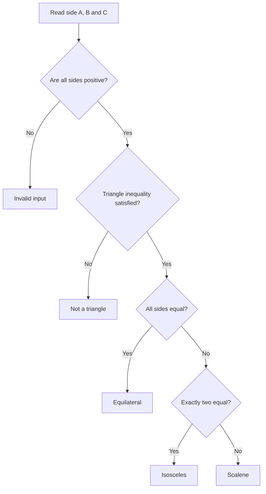

# Triangle Validator

A console application developed in Java that determines the type of a triangle based on the lengths of its three sides.

---

## Requirements

- Java JDK 21 or later
- IntelliJ IDEA Community Edition (recommended)

---

## Project Structure

```text
TriangleValidator
├── src
│   └── trianglevalidator
│       └── Main.java
├── .gitignore
└── README.md
```

---

## Algorithm

The application follows a two-stage process:

1. Read the three side lengths.
2. Verify that the values represent a valid triangle.
3. Classify the triangle according to the equality of its sides.



---

## Classification Rules

| Condition | Result |
|-----------|--------|
| Three equal sides | Equilateral |
| Two equal sides | Isosceles |
| Three different sides | Scalene |

---

## Example

```text
Enter side A: 3
Enter side B: 4
Enter side C: 5

The triangle is SCALENE
```

---

## Build and Run

Compile:

```bash
javac src/trianglevalidator/Main.java
```

Run:

```bash
java trianglevalidator.Main
```

Or simply open the project in IntelliJ IDEA and run the `Main` class.

---

## Author

**Anali Shantal Espinoza Aguilar**

Certification II  
Universidad Privada Boliviana